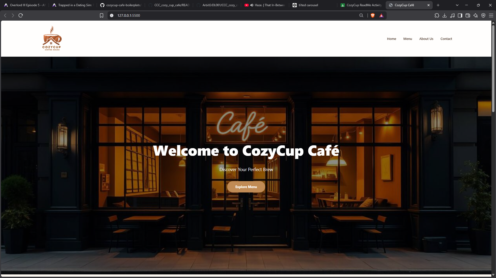
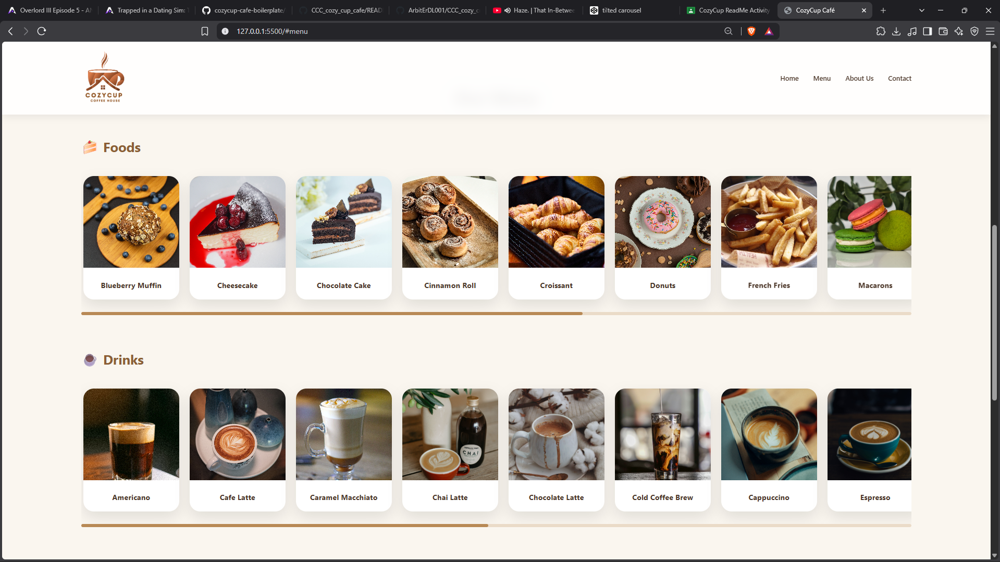
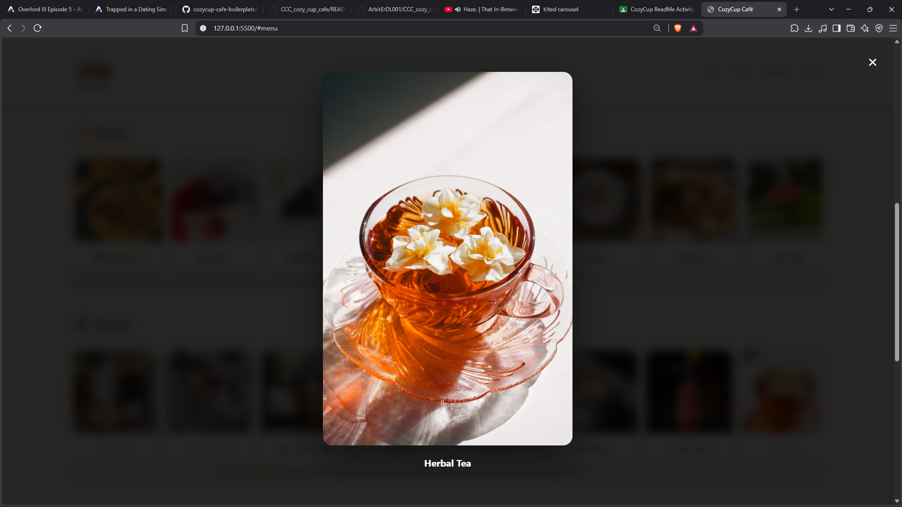

# CozyCup Café

## Project Description

CozyCup Café is a responsive café website designed to showcase a coffee shop's menu, products, and brand identity. The project features a modern landing page with food and drink sections, interactive image previews, and a warm café-inspired design to provide users with an enjoyable browsing experience.

## Features

- Responsive café landing page design
- Navigation bar with smooth scrolling sections
- Hero section with café background image
- Food and drinks menu display
- Horizontal scrolling menu cards
- Interactive image popup preview
- About Us section
- Contact section
- Responsive layout for desktop and mobile devices
- Modern animations and hover effects

## Screen Captures

### Home Page

The home page introduces CozyCup Café with a welcoming hero section, café background image, and a button that directs users to explore the menu.

---

### Food Menu Section

The food menu section displays different café foods including pastries, desserts, and meals using interactive cards.

---

### Drinks Menu Section

The drinks section showcases different beverages such as coffee, tea, smoothies, and specialty café drinks.

---

### Image Popup Feature

The image popup feature allows users to click menu items and view larger images with their corresponding names.

---

## About the Authors

**Name:** ΛΞDL
**Email:** 202380330@psu.palawan.edu.ph
